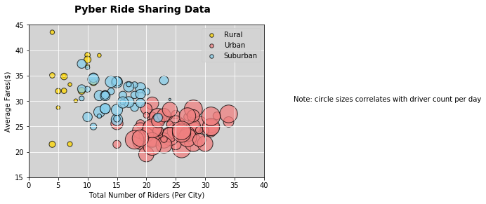

```python
import pandas as pd
import numpy as np
from matplotlib import pyplot as plt
from scipy import stats


```


```python
city = pd.read_csv("raw_data/city_data.csv")
print(city.head())
ride = pd.read_csv("raw_data/ride_data.csv")
ride.head()
```

                 city  driver_count   type
    0      Kelseyland            63  Urban
    1      Nguyenbury             8  Urban
    2    East Douglas            12  Urban
    3   West Dawnfurt            34  Urban
    4  Rodriguezburgh            52  Urban


<div>
<style>
    .dataframe thead tr:only-child th {
        text-align: right;
    }

    .dataframe thead th {
        text-align: left;
    }

    .dataframe tbody tr th {
        vertical-align: top;
    }
</style>
<table border="1" class="dataframe">
  <thead>
    <tr style="text-align: right;">
      <th></th>
      <th>city</th>
      <th>date</th>
      <th>fare</th>
      <th>ride_id</th>
    </tr>
  </thead>
  <tbody>
    <tr>
      <th>0</th>
      <td>Sarabury</td>
      <td>2016-01-16 13:49:27</td>
      <td>38.35</td>
      <td>5403689035038</td>
    </tr>
    <tr>
      <th>1</th>
      <td>South Roy</td>
      <td>2016-01-02 18:42:34</td>
      <td>17.49</td>
      <td>4036272335942</td>
    </tr>
    <tr>
      <th>2</th>
      <td>Wiseborough</td>
      <td>2016-01-21 17:35:29</td>
      <td>44.18</td>
      <td>3645042422587</td>
    </tr>
    <tr>
      <th>3</th>
      <td>Spencertown</td>
      <td>2016-07-31 14:53:22</td>
      <td>6.87</td>
      <td>2242596575892</td>
    </tr>
    <tr>
      <th>4</th>
      <td>Nguyenbury</td>
      <td>2016-07-09 04:42:44</td>
      <td>6.28</td>
      <td>1543057793673</td>
    </tr>
  </tbody>
</table>
</div>


```python
merge = pd.merge(city, ride, on = "city",how = "left")
#Average Fare ($) Per City
city_grouped = merge.groupby("city")
fare_per_city = city_grouped["fare"].mean()
#Total Number of Rides Per City
total_riders = city_grouped["ride_id"].count()
#Total Number of Drivers Per City
total_drivers = city_grouped["driver_count"].count()
#City Type (Urban, Suburban, Rural)
city_type = city_grouped['type'].unique()
city_data = pd.DataFrame({
    "Average Fare ($) Per City": fare_per_city,
    "Total Riders": total_riders ,
    "Total Drivers": total_drivers,
    "City Types": city_type
})
city_data.head()
```


<div>
<style>
    .dataframe thead tr:only-child th {
        text-align: right;
    }

    .dataframe thead th {
        text-align: left;
    }

    .dataframe tbody tr th {
        vertical-align: top;
    }
</style>
<table border="1" class="dataframe">
  <thead>
    <tr style="text-align: right;">
      <th></th>
      <th>Average Fare ($) Per City</th>
      <th>City Types</th>
      <th>Total Drivers</th>
      <th>Total Riders</th>
    </tr>
    <tr>
      <th>city</th>
      <th></th>
      <th></th>
      <th></th>
      <th></th>
    </tr>
  </thead>
  <tbody>
    <tr>
      <th>Alvarezhaven</th>
      <td>23.928710</td>
      <td>[Urban]</td>
      <td>31</td>
      <td>31</td>
    </tr>
    <tr>
      <th>Alyssaberg</th>
      <td>20.609615</td>
      <td>[Urban]</td>
      <td>26</td>
      <td>26</td>
    </tr>
    <tr>
      <th>Anitamouth</th>
      <td>37.315556</td>
      <td>[Suburban]</td>
      <td>9</td>
      <td>9</td>
    </tr>
    <tr>
      <th>Antoniomouth</th>
      <td>23.625000</td>
      <td>[Urban]</td>
      <td>22</td>
      <td>22</td>
    </tr>
    <tr>
      <th>Aprilchester</th>
      <td>21.981579</td>
      <td>[Urban]</td>
      <td>19</td>
      <td>19</td>
    </tr>
  </tbody>
</table>
</div>


```python
rural = city_data[city_data['City Types'] == 'Rural']
urban = city_data[city_data['City Types'] == 'Urban']
suburban = city_data[city_data['City Types'] == 'Suburban']
plt.scatter(rural["Total Riders"],rural["Average Fare ($) Per City"],marker = "o", facecolors = "gold",edgecolors = "black", s = rural["Total Drivers"]*10,alpha = 0.75, label = "Rural")
plt.scatter(urban["Total Riders"],urban["Average Fare ($) Per City"],marker = "o", facecolors = "lightcoral",edgecolors = "black", s = urban["Total Drivers"]*10,alpha = 0.75, label = "Urban")
plt.scatter(suburban["Total Riders"],suburban["Average Fare ($) Per City"],marker = "o", facecolors = "skyblue",edgecolors = "black", s = suburban["Total Drivers"]*10,alpha = 0.75, label = "Suburban")

legend = plt.legend(loc = "best", numpoints = 1, fontsize = 10)
legend.legendHandles[0]._sizes = [30]
legend.legendHandles[1]._sizes = [30]
legend.legendHandles[2]._sizes = [30]
plt.xlabel("Total Number of Riders (Per City)")
plt.ylabel("Average Fares($)")
plt.suptitle("Pyber Ride Sharing Data",fontsize = 14,fontweight = "bold")
plt.grid(True,color = 'white')
text = "Note: circle sizes correlates with driver count per day"
plt.text(38,30,text,fontsize = 10)
plt.subplots_adjust()
plt.xlim(0,36)
plt.ylim(15,45)
plt.rcParams['axes.facecolor'] = 'lightgrey'
plt.show()
```





```python
#% of Total Fares by City Type
city_group = merge.groupby(["type"])
fares = city_group["fare"].sum()
labels = fares.index
colors = ["gold","skyblue","lightcoral"]
explode = [0,0,0.1]
plt.pie(fares,explode = explode,colors = colors, labels = labels, startangle = 90,autopct = "%1.1f%%",shadow = True)
plt.axis("equal")
plt.title("% of Total Fares by City Type")
plt.show()
```


```python
#% of Total Rides by City Type
rides = city_group["ride_id"].count()
colors = ["gold","skyblue","lightcoral"]
explode = [0,0,0.1]
plt.pie(rides,explode = explode,colors = colors, labels = labels, startangle = 90,autopct = "%1.1f%%",shadow = True)
plt.axis("equal")
plt.title("% of Total Rides by City Type")
plt.show()
```


```python
#% of Total Drivers by City Type
drivers = city_group["driver_count"].sum()
colors = ["gold","skyblue","lightcoral"]
explode = [0,0,0.1]
plt.pie(drivers,explode = explode,colors = colors, labels = labels, startangle = 90,autopct = "%1.1f%%",shadow = True)
plt.axis("equal")
plt.title("% of Total Drivers by City Type")
plt.show()
```


